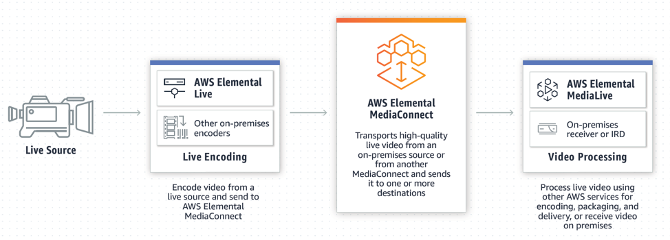
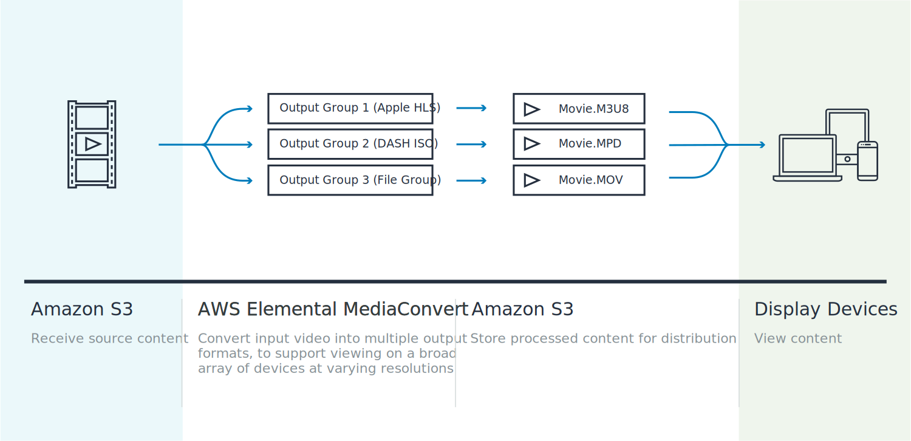
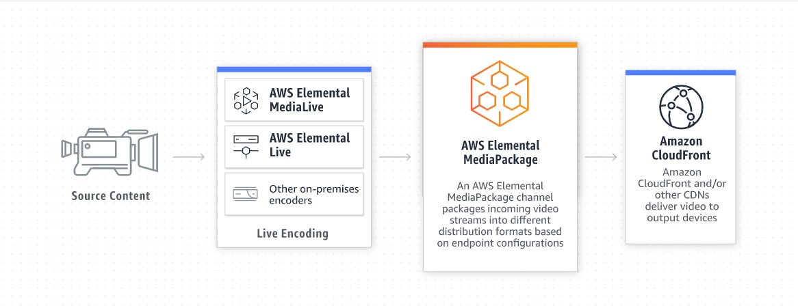

#  **Servicios Multimedia**
##  **Elastic Transcoder** 

Amazon Elastic Transcoder es un servicio que permite convertir medios digitales almacenados en Amazon S3 en los codecs de audio, video y los contenedores requeridos por los dispositivos de reproduccion del consumidor.  
  
**Tiene 3 componentes**

- ***pipelines***: Es donde se van a ordenar los "*jobs*" o trabajos de transcodificacion. Elastic Transcoder comienza a procesar en el orden en que se hayan agregado a un *pipeline*.
- ***Jobs***: Especifica las configuraciones que no estan incluidas por defecto. Por ejemplo, un archivo para transcodificar miniaturas. cada *job* convierte un archivo a un formato diferente. Al crear un *job*, este se agrega al *pipeline* que especifique,
- ***Presets***: Son plantillas que especifican las configuraciones de los archivos multimedia transcodificados. Ya existen algunos valores default para algunos formatos comunes. Tambien puede crear sus propios ajustes, cuando crea un  *job* especifica sus ajustes.
- ***Notificaciones***: Puede configurar *jobs* para que envien notificaciones a un *endpoint* de Amazon SNS cuando se complete el *job* o cuando se produzca un error.

## **Caracteristicas**

- **Escalable**: Puede procesar miles de archivos por hora, sin necesidad de instalar o administrar servidores.
- **Fácil de usar**: Puede crear *pipelines* y *jobs* con solo unos pocos clics en la consola de AWS.
- **Flexible**: Puede crear *pipelines* para procesar archivos de entrada en diferentes formatos y codificadores.

-------- [Getting Started with Elastic Transcoder](https://youtu.be/wSYHdt1TJVQ) ----------
##  **Kinesis Video Streams** 
Es un servicio de AWS completamente administrado que puede utilizar para transmitir vídeos en vivo desde dispositivos a la nube de AWS, o bien crear aplicaciones para el procesamiento de vídeo en tiempo real o el análisis de vídeo orientado a lotes.

## **Canales de señalización WebRTC**

- **SDK de dispositivos**: Kinesis Video Streams ofrece SDK de dispositivos para transmitir vídeo en vivo desde dispositivos a la nube de AWS. Los desarrolladores pueden utilizar Kinesis Video Streams para transmitir vídeo en vivo desde dispositivos a la nube de AWS mediante el uso de SDK de dispositivos para Android, iOS, Windows, Linux, etc.

- **SDK de navegadores**: Kinesis Video Streams ofrece SDK de navegadores para transmitir vídeo en vivo desde dispositivos a la nube de AWS. Los desarrolladores pueden utilizar Kinesis Video Streams para transmitir vídeo en vivo desde dispositivos a la nube de AWS mediante el uso de SDK de navegadores para Chrome, Firefox, etc.

- **Canal de señalización**: Kinesis Video Streams ofrece un canal de señalización para transmitir vídeo en vivo desde dispositivos a la nube de AWS. Utiliza recursos de AWS para streaming bidireccional de vídeo en vivo desde dispositivos a la nube de AWS.

- **Streaming de pares**: Streaming de audio y video de pares de baja latencia.

## **Caracteristicas principales**

- **Transmisión de vídeo en vivo**: Kinesis Video Streams permite a los desarrolladores transmitir vídeo en vivo desde dispositivos a la nube de AWS. Los desarrolladores pueden utilizar Kinesis Video Streams para transmitir vídeo en vivo desde cámaras IP, cámaras de vigilancia, drones, dispositivos móviles, sensores, etc. Kinesis Video Streams también permite a los desarrolladores transmitir vídeo en vivo desde dispositivos a aplicaciones web y móviles.

- **Procesamiento de vídeo en tiempo real**: Kinesis Video Streams permite a los desarrolladores procesar vídeo en tiempo real mediante el uso de AWS Lambda. Los desarrolladores pueden utilizar Kinesis Video Streams para procesar vídeo en tiempo real mediante el uso de AWS Lambda para realizar análisis de vídeo, detección de objetos, reconocimiento facial, etc.

- **Análisis de vídeo orientado a lotes**: Kinesis Video Streams permite a los desarrolladores analizar vídeo almacenado en AWS mediante el uso de AWS Lambda. Los desarrolladores pueden utilizar Kinesis Video Streams para analizar vídeo almacenado en AWS mediante el uso de AWS Lambda para realizar análisis de vídeo, detección de objetos, reconocimiento facial, etc.

- **Almacenamiento de vídeo**: Kinesis Video Streams permite a los desarrolladores almacenar vídeo en AWS. Los desarrolladores pueden utilizar Kinesis Video Streams para almacenar vídeo en AWS para su posterior análisis o procesamiento.

- **Pago por uso**: Kinesis Video Streams se factura por uso. Los desarrolladores pagan por el almacenamiento de vídeo y el procesamiento de vídeo en tiempo real y orientado a lotes. no hay costos anticipados ni mínimos.

- **Escalabilidad**: Kinesis Video Streams se puede escalar horizontalmente para manejar grandes volúmenes de vídeo. Los desarrolladores pueden escalar Kinesis Video Streams para manejar grandes volúmenes de vídeo.

- **Seguridad**: Kinesis Video Streams ofrece seguridad de nivel empresarial. Los desarrolladores pueden utilizar Kinesis Video Streams para transmitir vídeo en vivo desde dispositivos a la nube de AWS de forma segura.

- **Integración con AWS**: Kinesis Video Streams se integra con otros servicios de AWS. como por ejemplo, AWS Lambda, Amazon Rekognition, Amazon SageMaker, etc.

- **Integración con terceros**: Kinesis Video Streams se integra con otros servicios de terceros. como por ejemplo, Google Cloud Platform, Microsoft Azure, etc.

- **APIs de programación**: Kinesis Video Streams ofrece APIs de programación para transmitir vídeo en vivo desde dispositivos a la nube de AWS y para procesar vídeo en tiempo real o orientado a lotes.

- **Soporte de múltiples plataformas**: Kinesis Video Streams ofrece soporte de múltiples plataformas. como por ejemplo, Android, iOS, Windows, Linux, etc.

- **Soporte de múltiples formatos de vídeo**: Kinesis Video Streams ofrece soporte de múltiples formatos de vídeo. como por ejemplo, H.264, H.265, VP8, VP9, etc.

- **Soporte de múltiples formatos de audio**: Kinesis Video Streams ofrece soporte de múltiples formatos de audio. como por ejemplo, AAC, MP3, etc.

- **Soporte de múltiples formatos de contenedor**: Kinesis Video Streams ofrece soporte de múltiples formatos de contenedor. Como por ejemplo, MP4, MKV, MOV, etc.

- **Soporte de múltiples resoluciones de vídeo**: Kinesis Video Streams ofrece soporte de múltiples resoluciones de vídeo. como por ejemplo, 1080p, 720p, 480p, 360p, 240p, etc.

- **Control de acceso**: Kinesis Video Streams ofrece control de acceso. Se integra con AWS Identity and Access Management (IAM) para proporcionar control de acceso a los desarrolladores.

- **Completo**: Kinesis Video Streams es un servicio de AWS completamente administrado. Los desarrolladores no tienen que administrar ni escalar servidores.

## **Funcionamiento**

Kinesis Video Streams se compone de tres componentes principales:

- **Streams**: Los streams son contenedores de vídeo que almacenan vídeo en AWS. Los streams se pueden crear mediante la API de programación de Kinesis Video Streams o mediante la consola de administración de AWS. Los streams se pueden escalar horizontalmente para manejar grandes volúmenes de vídeo.

- **Producers**: Los producers son aplicaciones que transmiten vídeo en vivo desde dispositivos a los streams de Kinesis Video Streams. Los producers se pueden crear mediante la API de programación de Kinesis Video Streams o mediante la consola de administración de AWS. Los producers se pueden escalar horizontalmente para manejar grandes volúmenes de vídeo.

- **Consumers**: Los consumers son aplicaciones que procesan vídeo en tiempo real o orientado a lotes almacenado en los streams de Kinesis Video Streams. Los consumers se pueden crear mediante la API de programación de Kinesis Video Streams o mediante la consola de administración de AWS. Los consumers se pueden escalar horizontalmente para manejar grandes volúmenes de vídeo.

## **Usos practicos**

- **Netflix**: Netflix utiliza Kinesis Video Streams con el objetivo de detectar y corregir errores rapidamente, lo que permite a los usuarios disfrutar de una experiencia de visualización de vídeo sin problemas.

- **Sonos**: Sonos utiliza Kinesis Video Streams para transmitir vídeo en vivo desde dispositivos a la nube de AWS de forma segura.

- **Zillow**: Zillow utiliza Kinesis Video Streams para recopilar datos de registros publicos y listas MLS y luego actualizar los datos de las propiedades en la aplicación móvil de Zillow.

[First steps with Kinesis Video Streams](https://www.youtube.com/watch?v=X0SKArvV7oI)

##  **Amazon Nimble Studio** 

Amazon Nimble Studio es un conjunto de servicios que permite a los estudios creativos producir efectos visuales, animaciones y contenido de juegos por completo en la nube. Incorpore el talento creativo en cuestión de minutos y con disponibilidad en los principales mercados de creación; puede buscar y contratar a los mejores talentos para el proyecto.

## **Como funciona**

En tan solo unas horas, puede crear un nuevo entorno de estudio en el que los talentos creativos puedan acceder de inmediato a estaciones de trabajo virtuales con tecnología de instancias de Amazon Elastic Compute Cloud (EC2) y almacenamiento de alta velocidad de Amazon FSx. Los artistas pueden trabajar con sus aplicaciones creativas de terceros preferidas y aplicaciones de software personalizadas mediante imágenes de máquina de Amazon (AMI) compatibles con los sistemas operativos Windows y Linux.

## **Sistemas operativos compatibles**

Podras utilizar Linux o Windows con Nimble Studio. Se pueden utilizar la mayoría de los inicios de sesión con credenciales basadas en usuarios de Foundry, Autodesk y Adobe.

Nimble Studio admite floating licenses de la industria de software creativo. Aplicaciones como Hourly Render, Maya, 3ds Max, Houdini, Nuke, Mari, Arnold, V-Ray, Redshift, Octane, Substance, etc. Nimble Studio no admite licencias de node-locked.

Blender esta incluido en Nimble Studio Workstation Amazon Machine Images.

## **Caracteristicas**

- **Gestion remota de equipos**: Se incorpora rapidamente a los equipos de trabajo de los estudios creativos. Los artistas pueden acceder a sus estaciones de trabajo virtuales desde cualquier lugar, en cualquier momento, y trabajar en equipo con otros artistas. Un beneficio adicional es que puede reducir los costos de infraestructura y administración de TI.

- **Seguridad**: Nimble Studio proporciona seguridad de extremo a extremo para los datos de los estudios creativos. Los datos se almacenan en Amazon S3 y Amazon FSx, que se pueden cifrar con AWS Key Management Service (KMS). Los datos se transmiten a través de Amazon Virtual Private Cloud (VPC) y Amazon Elastic Network Interfaces (ENI). Los datos se pueden almacenar en Amazon S3 y Amazon FSx, que se pueden cifrar con AWS Key Management Service (KMS). Los datos se transmiten a través de Amazon Virtual Private Cloud (VPC) y Amazon Elastic Network Interfaces (ENI).

- **Precios**: Nimble Studio ofrece precios flexibles y escalables. Los estudios creativos solo pagan por el tiempo que utilizan. Los precios se basan en el número de horas de uso de la estación de trabajo virtual y el tipo de instancia de EC2 que se utiliza.
    + **Imporante**: Los precios de Nimble Studio varían según la región. Para obtener los precios actuales, consulte la página de precios de Amazon Nimble Studio. [Amazon Nimble Studio Pricing](https://aws.amazon.com/es/nimble-studio/pricing/)

## **Configuracion e implementacion**

la belleza de Nimble Studio es que la configuracion toma un par de horas, no semanas. 

StudioBuilder es la herramienta de implementacion de Nimble Studio. StudioBuilder es una herramienta de línea de comandos que se ejecuta en su computadora local. StudioBuilder crea un entorno de estudio en la nube de AWS y lo configura para que los artistas puedan acceder a sus estaciones de trabajo virtuales. 

algunas caracteristicas de Nimble Studio son:

- Aws IAM identity Center para la gestion de usuarios y roles.
- Acesso bajo demanda a las estaciones de trabajo virtuales, utilizando Amazon EC2 Spot Instances.
- Renderizado integrado con (RFDK) Render Farm Development Kit.
- Plantillas con (AMI) Amazon Machine Images.
- Amazon FSx for Lustre para almacenamiento de archivos de alto rendimiento.
- Una red virtual privada a través de Amazon (VPC) [Amazon Virtual Private Cloud](https://docs.aws.amazon.com/vpc/latest/userguide/how-it-works.html).

[empezando con Nimble Studio](https://www.youtube.com/watch?v=dKIEGm0cjP4)  
[Demostracion de Nimble Studio con Videojuegos](https://www.youtube.com/watch?v=zfkHi1ft25I)

#  **AWS Elemental** 

AWS Elemental es una familia de productos de AWS que permite a los clientes crear, distribuir y monetizar contenido de video en cualquier dispositivo, en cualquier lugar y en cualquier momento. AWS Elemental ofrece una amplia gama de productos y servicios que incluyen AWS Elemental MediaConvert, AWS Elemental MediaLive, AWS Elemental MediaPackage, AWS Elemental MediaStore, AWS Elemental MediaTailor, AWS Elemental MediaConnect, AWS Elemental Media Services y AWS Elemental Cloud.

### **AWS Elemental MediaConnect**

AWS Elemental MediaConnect es un servicio de entrega de video en la nube que permite a los clientes transmitir contenido de video en vivo y almacenado a través de una red de entrega de video privada. AWS Elemental MediaConnect se integra con AWS Elemental MediaLive y AWS Elemental MediaPackage para proporcionar una solución de entrega de video en la nube completa.

+ **Beneficios y caracteristicas**
    - **Transporte confiable de video**: Agrega una capa de calidad de servicio específica de video sobre el transporte IP estándar, lo que permite la entrega ininterrumpida de video en vivo de alta calidad para aplicaciones de empresa a empresa. Esto hace que sus flujos de trabajo de video en vivo sean más confiables, incluso en redes menos confiables. 
    - **Entrega de video en vivo de forma segura**: Permite proteger su video en vivo mediante el cifrado estándar de la industria y solo compartir contenido con clientes autorizados. Esto le da control sobre la distribución de su contenido.

 <h2><b>Como Funciona</b></h2> 

    

### **AWS Elemental MediaConvert**

AWS Elemental MediaConvert es un servicio de conversión de video en la nube que permite a los clientes convertir contenido de video en vivo y almacenado a formatos de video y audio compatibles con dispositivos de destino. AWS Elemental MediaConvert se integra con AWS Elemental MediaLive y AWS Elemental MediaPackage para proporcionar una solución de entrega de video en la nube completa.

+ **Beneficios y caracteristicas**
    - **Creacion de video apto para su retrasmision**: Diseñado con la tecnología establecida de AWS Elemental, AWS Elemental MediaConvert le ofrece un conjunto completo de características para crear experiencias de visionado atractivas, incluidas superposiciones de gráficos, protección de contenido, audio en varios idiomas, inclusión de subtítulos y formatos de retransmisiones profesionales.
    - **Escalabilidad y rendimiento**: AWS Elemental MediaConvert se ejecuta en una red de AWS global de centros de datos, lo que le permite escalar el rendimiento de conversión de video en la nube según sus necesidades. Puede comenzar con una pequeña configuración y escalar a medida que crece su negocio.
    - **Sencillez**: AWS Elemental MediaConvert no requiere la configuración, administración o mantenimiento de la infraestructura subyacente. Solo tiene que enviar los trabajos con la configuración de procesamiento de video que desee para ponerse a trabajar.
    - **Precios de uso**: Pague solo por el tiempo que use AWS Elemental MediaConvert. No tiene que pagar por la infraestructura subyacente ni por el software de conversión de video.

 <h2><b>Como Funciona</b></h2> 

    

### **AWS Elemental MediaLive**

AWS Elemental MediaLive es un servicio de transmisión de video en la nube que permite a los clientes transmitir contenido de video en vivo a través de una red de entrega de video privada. AWS Elemental MediaLive se integra con AWS Elemental MediaConnect y AWS Elemental MediaPackage para proporcionar una solución de entrega de video en la nube completa.

+ **Beneficios y caracteristicas**
    - **Transmisión de video en vivo resiliente y de alta calidad**: AWS Elemental MediaLive le permite transmitir video en vivo de alta calidad a través de una red de entrega de video privada. Puede transmitir contenido de video en vivo desde cualquier lugar, incluidos estudios de televisión, eventos deportivos, conciertos y eventos en vivo.
    - **Caracteristicas de Brodcast-grade**: Personalice las configuraciones de parámetros de codificación y use funciones de audio avanzadas con mapeo de canales de audio, normalización de audio y compatibilidad con Dolby. El servicio admite múltiples estándares de subtítulos como WebVTT y TTML. 
    - **Amplio monitoreo y operaciones**: Supervise varias métricas, estados y alertas basados ​​en canales.
    - **Aprivisionamiento rapido**: Cree canales de transmisión de video en vivo en minutos con la consola de administración de AWS Elemental MediaLive o con la API de AWS Elemental MediaLive.

### **AWS Elemental MediaPackage**

AWS Elemental MediaPackage es un servicio de originación y empaquetado justo a tiempo que le permite ofrecer salidas en vivo altamente seguras y confiables y recursos de video a pedido para una variedad de dispositivos. AWS Elemental MediaPackage se integra con AWS Elemental MediaLive y AWS Elemental MediaStore para proporcionar una solución de entrega de video en la nube completa.

+ **Beneficios y caracteristicas**
    - **Just-in-time packaging**: Ahorre espacio de almacenamiento formateando el video solo cuando sea necesario, para una amplia gama de dispositivos conectados. Asegúrese de que sus transmisiones en vivo y bajo demanda estén siempre actualizadas con las últimas evoluciones de formatos de transmisión.
    - **Integracion con sistemas de terceros**: AWS Elemental MediaPackage se integra con AWS Elemental MediaLive y AWS Elemental MediaStore para proporcionar una solución de entrega de video en la nube completa. También se integra con sistemas de terceros, como Akamai, CloudFront, Google Cloud CDN y Microsoft Azure CDN.
    - **Escalabilidad y rendimiento**: AWS Elemental MediaPackage se ejecuta en una red de AWS global de centros de datos, lo que le permite escalar el rendimiento de conversión de video en la nube según sus necesidades. Puede comenzar con una pequeña configuración y escalar a medida que crece su negocio.
    - **Experiencias de audiencia**: Use funciones de grado de transmisión, como la funcionalidad en vivo a VOD para funciones de TV de reinicio y puesta al día. Aborde los requisitos de accesibilidad del contenido a través del soporte del servicio de audio Dolby, múltiples idiomas y múltiples estándares de subtítulos.

 <h2><b>Como Funciona</b></h2> 

    

### **AWS Elemental MediaStore**

AWS Elemental MediaStore es un servicio de almacenamiento de AWS optimizado para medios. Le brinda el rendimiento, la consistencia y la baja latencia necesarios para entregar contenido de video de transmisión en vivo a escala.

+ **Beneficios y caracteristicas**
    - **Alto rendimiento, optimizado para medios**: AWS Elemental MediaStore le permite almacenar y entregar contenido de video de transmisión en vivo a una amplia gama de dispositivos conectados. El servicio ofrece un rendimiento consistente y bajo latencia para entregar contenido de video de alta calidad a los espectadores.
    - **Integrado con servicios de seguridad de AWS**: AWS Elemental MediaStore se integra con AWS Identity and Access Management (IAM) para proporcionar un control de acceso granular a los recursos de almacenamiento de medios. También se integra con AWS Key Management Service (KMS) para proporcionar un control de acceso granular a los recursos de almacenamiento de medios.
    - **Escalabilidad y rendimiento**: Elimine los gastos y la complejidad de la capacidad de aprovisionamiento previo con el escalado automático.
    - **Transicion automatica de medios**: Obtenga una caché replicada optimizada para el rendimiento y la disponibilidad. Los objetos se transfieren al almacenamiento respaldado por S3 poco después de recibirlos, lo que proporciona una durabilidad duradera.

### **AWS Elemental MediaTailor**

AWS Elemental MediaTailor es un servicio de publicidad en la nube que le permite insertar anuncios en vivo y a pedido en contenido de video en vivo y almacenado. AWS Elemental MediaTailor se integra con AWS Elemental MediaPackage para proporcionar una solución de entrega de video en la nube completa.     

+ **Beneficios y caracteristicas**
    - **Creacion y distribucion de canales eficientes**: Cree transmisiones en vivo con un bajo costo de ejecución de manera eficiente mediante el uso de contenido codificado existente. Proporcione a los espectadores videos de mejor calidad utilizando códecs avanzados para una mayor calidad con menos bits para reducir los costos de distribución.
    - **Personalizacion de la experiencia del espectador**: Proporcione una experiencia de visualización personalizada a los espectadores con la capacidad de insertar anuncios en vivo y a pedido en contenido de video en vivo y almacenado.
    - **Experiencia de reproduccion mejorada**: Transcodifique los anuncios justo a tiempo para asegurarse de que la tasa de bits y las resoluciones del contenido del anuncio coincidan con la configuración del contenido principal y, al mismo tiempo, evite los bloqueadores de anuncios.
    - **Escalado para picos de trasmision en vivo**: Proporcione una experiencia de visualización consistente a los espectadores con la capacidad de escalar el rendimiento de la transmisión en vivo según las necesidades de los espectadores.
    

### **De:** Juan Diego Suarez Vega
### **Codigo:** 20201020095
